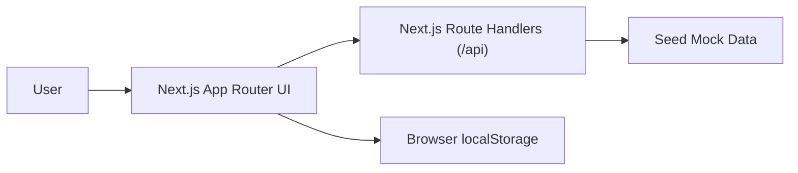
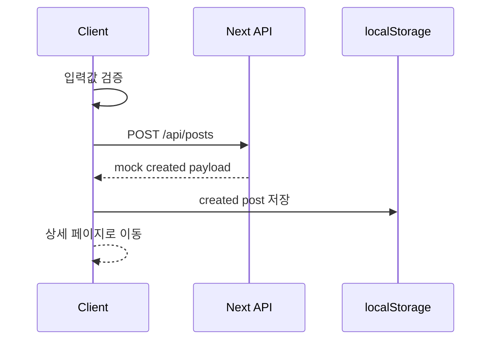
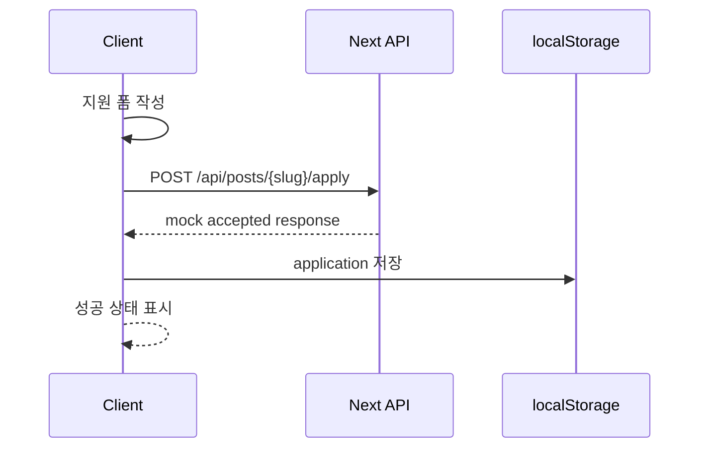

# 02. Architecture

## 1) 기술 스택 선택 이유

| 영역 | 선택 기술 | 선택 이유 | 대안 |
| --- | --- | --- | --- |
| Frontend | Next.js 16 + React 19 + TypeScript | Vercel 배포가 가장 자연스럽고 App Router로 페이지 구성과 SEO 대응이 쉽다. | Vite + React |
| Styling | Tailwind CSS 4 | 랜딩 페이지와 카드 UI를 빠르게 조합하고 발표용 시각 밀도를 높이기 좋다. | CSS Modules |
| Mock API | Next.js Route Handlers | 별도 서버 없이도 API 형태를 흉내 내며 데모 흐름과 문서 일관성을 맞출 수 있다. | 프론트엔드 전용 상태 관리 |
| Demo Storage | 브라우저 localStorage | 실제 DB 없이도 글쓰기 / 지원하기 결과를 사용자의 브라우저에 남길 수 있다. | IndexedDB |
| Infra | Vercel | Next.js 기본 배포 플랫폼이며 워크숍 시연에 적합하다. | Netlify |

## 2) 시스템 구성



설명:

- 프론트 역할: 랜딩, 목록, 상세, 글쓰기, 지원하기 화면 렌더링과 상호작용 처리
- API 역할: 목록/상세 조회와 mock 생성/지원 응답 제공
- 데이터 저장 방식: 기본 모집글은 코드 내 seed 데이터로 제공하고, 사용자가 만든 글과 지원 이력은 localStorage에 저장

## 3) 레이어 구조

- App Router Page: 경로별 화면 구성
- UI Components: 카드, 배지, 헤더, 폼, CTA 등 재사용 컴포넌트
- Feature Layer: 모집글 목록 필터링, 글쓰기, 지원하기 흐름
- Mock Repository: seed 데이터와 localStorage 데이터를 합성하는 유틸
- Route Handlers: `/api/posts`, `/api/posts/[slug]`, `/api/posts/[slug]/apply` 등 mock API 응답

현재 프로젝트 구조:

```text
src/
├─ app/
│  ├─ api/
│  ├─ recruit/
│  └─ page.tsx
├─ components/
├─ data/
├─ lib/
└─ types/
```

## 4) 데이터 모델

### Entity A. RecruitPost

| 필드 | 타입 | 설명 | 필수 여부 |
| --- | --- | --- | --- |
| `id` | `string` | 내부 식별자 | Yes |
| `slug` | `string` | 상세 페이지 경로 식별자 | Yes |
| `title` | `string` | 모집글 제목 | Yes |
| `category` | `"study" | "project" | "hackathon"` | 모집 유형 | Yes |
| `campus` | `string` | 활동 캠퍼스 또는 온라인 여부 | Yes |
| `summary` | `string` | 카드용 요약 문장 | Yes |
| `description` | `string` | 상세 설명 | Yes |
| `roles` | `string[]` | 모집 역할 목록 | Yes |
| `techStack` | `string[]` | 사용 기술 | No |
| `capacity` | `number` | 추가 모집 인원 | Yes |
| `stage` | `string` | 아이디어 단계, 진행 중 등 상태 | Yes |
| `deadline` | `string` | 모집 마감일 | Yes |
| `createdAt` | `string` | 생성 시각 | Yes |
| `highlight` | `boolean` | 메인 강조 노출 여부 | Yes |

### Entity B. RecruitApplication

| 필드 | 타입 | 설명 | 필수 여부 |
| --- | --- | --- | --- |
| `id` | `string` | 내부 식별자 | Yes |
| `postSlug` | `string` | 지원 대상 모집글 slug | Yes |
| `name` | `string` | 지원자 이름 | Yes |
| `contact` | `string` | 이메일 또는 오픈채팅 링크 | Yes |
| `message` | `string` | 자기소개 및 지원 동기 | Yes |
| `createdAt` | `string` | 지원 시각 | Yes |

## 5) 정합성 규칙

- `slug`는 고유해야 한다.
- 글쓰기 폼의 필수 항목이 비어 있으면 게시글을 생성할 수 없다.
- 같은 브라우저에서 동일 모집글에 동일 연락처로 중복 지원하면 경고 메시지를 보여준다.
- mock 데이터는 발표 재현성을 위해 seed 데이터를 항상 기본으로 유지한다.

## 6) 핵심 시퀀스 다이어그램

### Flow A. 모집글 작성



### Flow B. 모집글 지원하기



## 7) 운영/배포 메모

- 실행 환경: Node.js 24 로컬 개발, Vercel 배포
- 환경 변수: MVP 기준 필수 환경 변수 없음
- 배포 전략: GitHub 연동 후 Vercel에서 Next.js 프로젝트로 Import
- 로깅/모니터링 계획: 워크숍 MVP에서는 브라우저 콘솔과 Vercel 배포 로그 수준으로 제한
