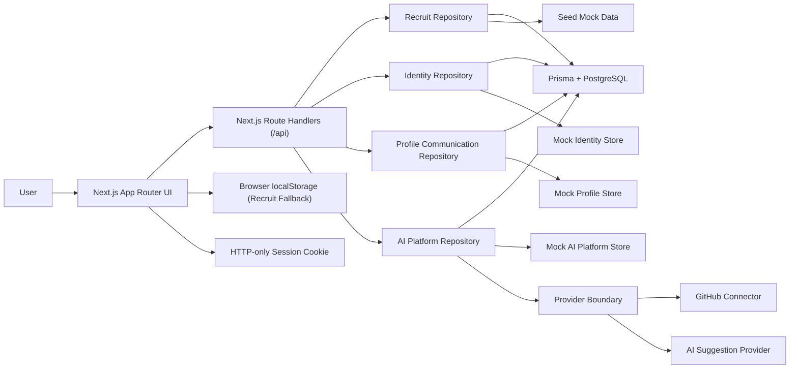
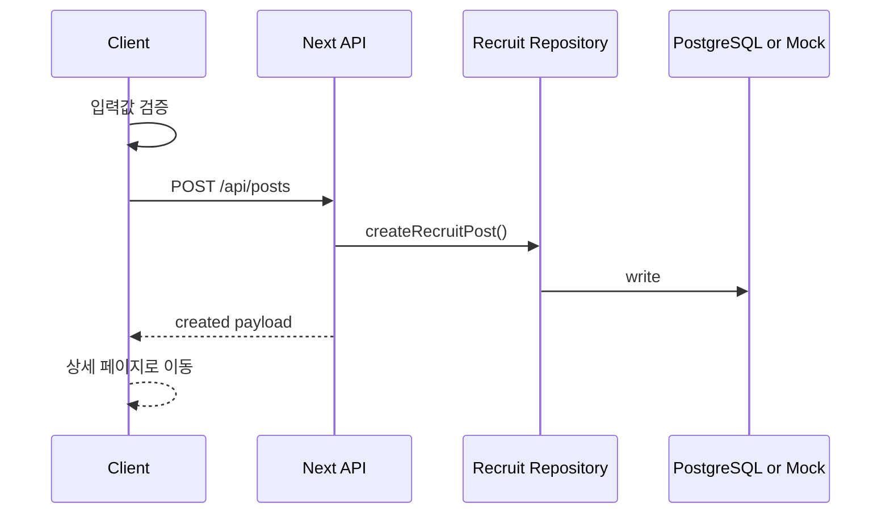
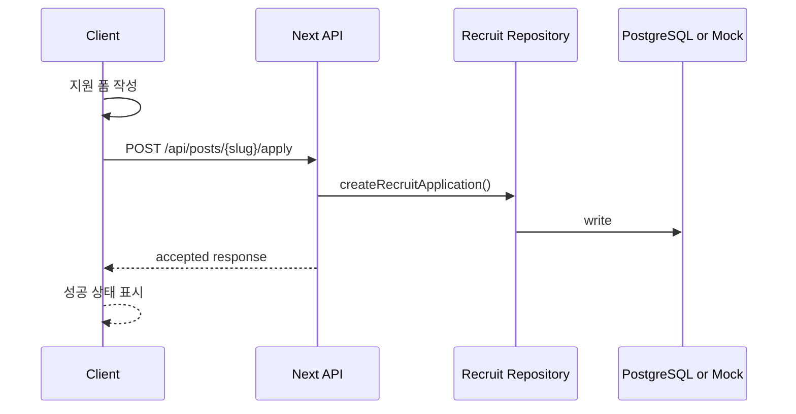
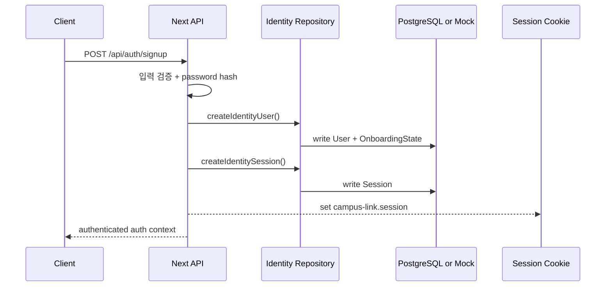
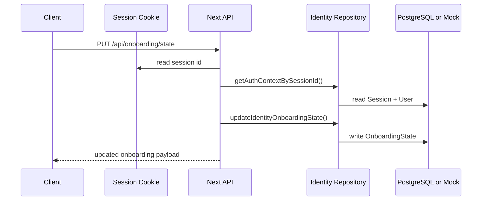
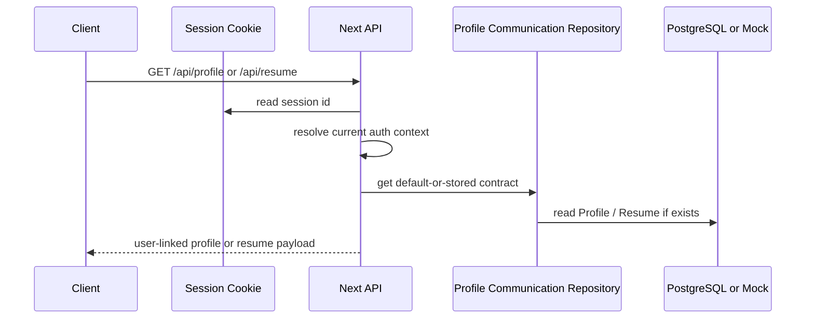
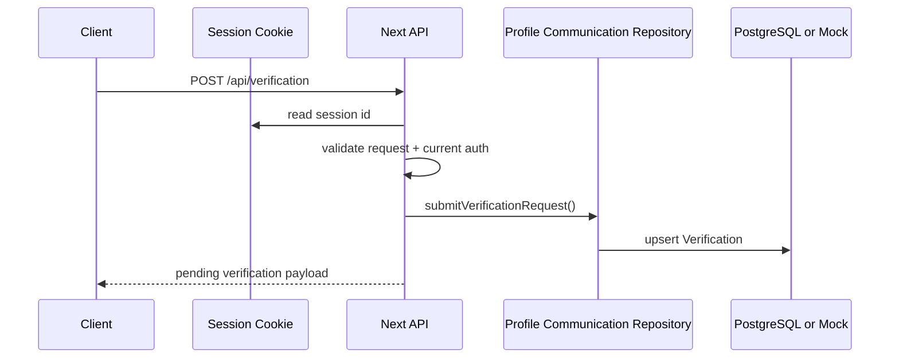
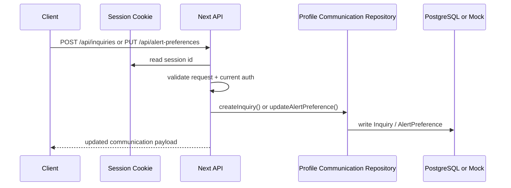
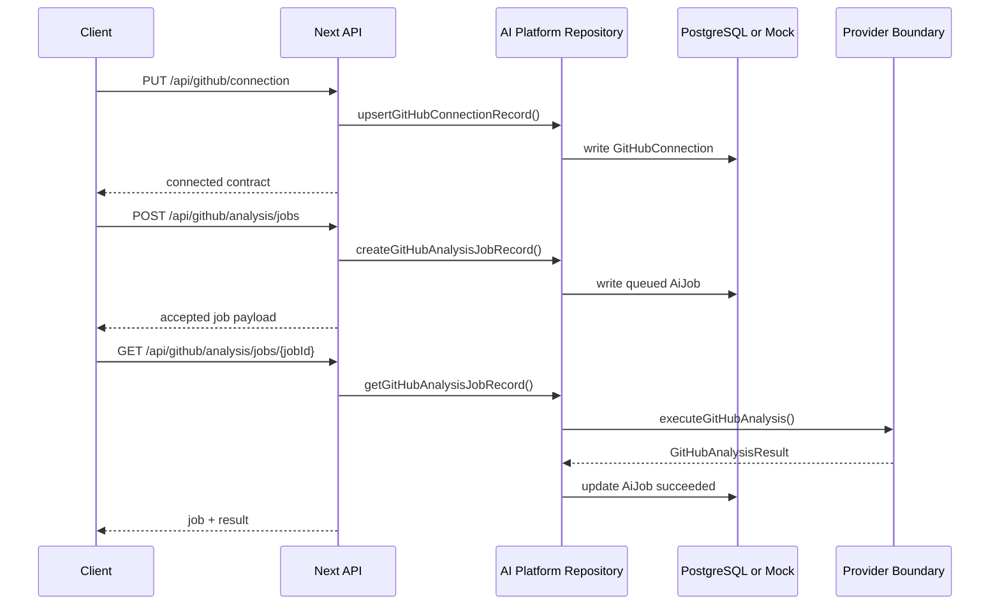
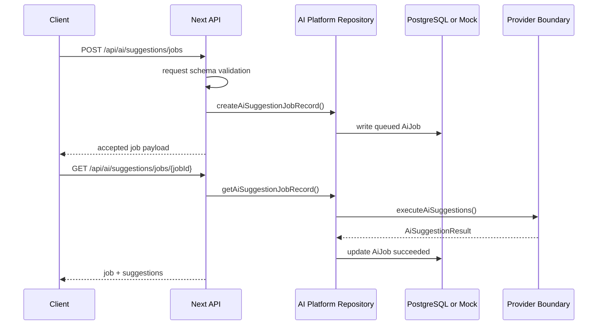

# 02. Architecture

## 1) 기술 스택 선택 이유

| 영역 | 선택 기술 | 선택 이유 | 대안 |
| --- | --- | --- | --- |
| Frontend | Next.js 16 + React 19 + TypeScript | Vercel 배포가 가장 자연스럽고 App Router로 페이지 구성과 SEO 대응이 쉽다. | Vite + React |
| Styling | Tailwind CSS 4 | 랜딩 페이지와 카드 UI를 빠르게 조합하고 발표용 시각 밀도를 높이기 좋다. | CSS Modules |
| Mock API | Next.js Route Handlers | 별도 서버 없이도 API 형태를 흉내 내며 데모 흐름과 문서 일관성을 맞출 수 있다. | 프론트엔드 전용 상태 관리 |
| Database Layer | Prisma + PostgreSQL | 실제 서비스 전환 시 repository contract를 유지하면서 관계형 데이터 모델을 확장하기 쉽다. | MongoDB |
| Demo Storage | 브라우저 localStorage fallback | DB 환경 변수가 없을 때도 발표용 흐름을 유지할 수 있다. | IndexedDB |
| Infra | Vercel | Next.js 기본 배포 플랫폼이며 워크숍 시연에 적합하다. | Netlify |

## 2) 시스템 구성



설명:

- 프론트 역할: 랜딩, 목록, 상세, 글쓰기, 지원하기 화면 렌더링과 상호작용 처리
- API 역할: 모집글 API와 함께 Phase 1 auth / onboarding, Phase 2 profile / resume / verification / inquiry / alert preference, Phase 3 GitHub / AI job API 응답 제공
- Repository 역할: `RECRUIT_DATA_SOURCE` 값에 따라 PostgreSQL 또는 mock 저장소를 선택
- Demo 안전장치: `RECRUIT_DATA_SOURCE=database` 이어도 `DATABASE_URL` 누락이나 Prisma 조회 실패가 나면 repository layer가 mock 저장소로 강등되어 프로필/모집 데모 흐름을 유지한다
- Recruit 데이터 저장 방식: 기본값은 seed 데이터와 localStorage fallback, DB 모드에서는 Prisma를 통해 PostgreSQL 사용
- Identity 데이터 저장 방식: Phase 1 기준으로 같은 data source 모드를 따르며, mock 모드에서는 메모리 저장소와 demo 계정을 사용하고 DB 모드에서는 Prisma `User`, `Session`, `OnboardingState`를 사용한다
- Profile Communication 데이터 저장 방식: Phase 2 기준으로 같은 data source 모드를 따르며, mock 모드에서는 demo 프로필/이력서/문의/알림 설정 store를 사용하고 DB 모드에서는 Prisma `Profile`, `Resume`, `Verification`, `Inquiry`, `AlertPreference`를 사용한다
- AI Platform 데이터 저장 방식: Phase 3 기준으로 같은 data source 모드를 따르며, mock 모드에서는 runtime GitHub connection/job store를 사용하고 DB 모드에서는 Prisma `GitHubConnection`, `AiJob`를 사용한다
- Provider Boundary 역할: GitHub 연결/분석과 suggestion 생성을 repository 뒤에 감춰 downstream 브랜치가 provider별 raw 응답 shape를 직접 다루지 않게 한다
- 세션 경계: 세션 본문은 서버 저장소에 보관하고, 브라우저에는 `campus-link.session` HTTP-only cookie로 세션 식별자만 전달한다
- 프로필 셸 방식: Phase 1 D 트랙에서는 A 트랙 계약이 머지되기 전까지 branch-local adapter로 사용자/관리자 프로필 셸과 역할별 진입 구조만 제공한다
- Phase 2 기본 레코드 방식: `Profile`, `Resume`, `Verification`, `AlertPreference`는 저장 레코드가 없어도 identity 기반 fallback contract를 먼저 반환하고, 첫 수정/제출 시 영구 저장 경계에 upsert 한다
- Phase 3 job 방식: GitHub 분석과 AI suggestion은 모두 poll 기반 `AiJob` 상태 모델을 따르며 `queued -> running -> succeeded | failed` 전이를 공유한다

## 3) 레이어 구조

- App Router Page: 경로별 화면 구성
- UI Components: 카드, 배지, 헤더, 폼, CTA 등 재사용 컴포넌트
- Feature Layer: 모집글 목록 필터링, 글쓰기, 지원하기 흐름
- Identity Contracts: `User`, `Role`, `Session`, `OnboardingState`와 auth context 타입
- Phase 2 Contracts: `Profile`, `Resume`, `Verification`, `Inquiry`, `AlertPreference`와 각 enum / payload 타입
- Phase 3 Contracts: `GitHubConnection`, `CreateGitHubAnalysisJobRequest`, `CreateAiSuggestionJobRequest`, `AiJob`, `AiSuggestionResult`와 provider catalog 타입
- Profile Shell Adapter: A 트랙 계약이 머지되기 전까지 사용자/관리자 프로필 셸에 임시 view model을 공급하는 branch-local adapter
- Recruit Repository: Prisma/PostgreSQL과 mock 저장소를 전환하는 유틸
- Identity Repository: mock 계정, 세션, 온보딩 상태를 관리하고 Prisma 저장소와 전환하는 유틸
- Profile Communication Repository: profile / resume / verification / inquiry / alert preference 저장 경계를 관리하고 mock/Prisma를 전환하는 유틸
- AI Platform Repository: GitHub 연결 1:1 레코드와 `AiJob` 생성/조회 경계를 관리하고 mock/Prisma를 전환하는 유틸
- AI Provider Boundary: GitHub 분석기와 suggestion 생성기를 `mock_analysis`, `mock_suggestions`, 향후 `openai` 같은 provider key 뒤에 숨기는 실행 계층
- Route Handlers: `/api/posts`, `/api/auth/*`, `/api/onboarding/state`, `/api/profile`, `/api/resume`, `/api/verification`, `/api/inquiries`, `/api/alert-preferences`, `/api/github/*`, `/api/ai/suggestions/*` 등 API 응답
- Session Helper: cookie 기반 현재 세션 조회를 downstream 브랜치가 재사용할 수 있게 제공

현재 프로젝트 구조:

```text
prisma/
├─ schema.prisma
src/
├─ app/
│  ├─ api/
│  │  ├─ ai/
│  │  ├─ auth/
│  │  ├─ alert-preferences/
│  │  ├─ github/
│  │  ├─ inquiries/
│  │  ├─ profile/
│  │  ├─ resume/
│  │  ├─ verification/
│  │  └─ onboarding/
│  ├─ admin/
│  ├─ entry/
│  ├─ login/
│  ├─ profile/
│  ├─ people/
│  ├─ resume/
│  ├─ recruit/
│  ├─ verification/
│  └─ page.tsx
├─ components/
├─ data/
├─ lib/
│  ├─ ai-platform.ts
│  └─ server/
└─ types/
```

## 4) 데이터 모델

### Entity A. RecruitPost

| 필드 | 타입 | 설명 | 필수 여부 |
| --- | --- | --- | --- |
| `id` | `string` | 내부 식별자 | Yes |
| `slug` | `string` | 상세 페이지 경로 식별자 | Yes |
| `title` | `string` | 모집글 제목 | Yes |
| `category` | `"study" | "project" | "hackathon"` | 모집 유형 | Yes |
| `campus` | `string` | 활동 캠퍼스 또는 온라인 여부 | Yes |
| `summary` | `string` | 카드용 요약 문장 | Yes |
| `description` | `string` | 상세 설명 | Yes |
| `roles` | `string[]` | 모집 역할 목록 | Yes |
| `techStack` | `string[]` | 사용 기술 | No |
| `capacity` | `number` | 추가 모집 인원 | Yes |
| `stage` | `string` | 아이디어 단계, 진행 중 등 상태 | Yes |
| `deadline` | `string` | 모집 마감일 | Yes |
| `createdAt` | `string` | 생성 시각 | Yes |
| `highlight` | `boolean` | 메인 강조 노출 여부 | Yes |

### Entity B. RecruitApplication

| 필드 | 타입 | 설명 | 필수 여부 |
| --- | --- | --- | --- |
| `id` | `string` | 내부 식별자 | Yes |
| `postSlug` | `string` | 지원 대상 모집글 slug | Yes |
| `name` | `string` | 지원자 이름 | Yes |
| `contact` | `string` | 이메일 또는 오픈채팅 링크 | Yes |
| `message` | `string` | 자기소개 및 지원 동기 | Yes |
| `createdAt` | `string` | 지원 시각 | Yes |

### Shared Enum C. Role

| 값 | 설명 |
| --- | --- |
| `student` | 일반 사용자 기본 역할 |
| `admin` | 관리자 기본 역할 |

### Entity D. User

| 필드 | 타입 | 설명 | 필수 여부 |
| --- | --- | --- | --- |
| `id` | `string` | 내부 사용자 식별자 | Yes |
| `email` | `string` | 로그인 식별 이메일 | Yes |
| `displayName` | `string` | UI 노출 기본 이름 | Yes |
| `campus` | `string \| null` | 캠퍼스 또는 소속 텍스트 | No |
| `role` | `Role` | 역할 구분 | Yes |
| `createdAt` | `string` | 가입 시각 | Yes |
| `updatedAt` | `string` | 마지막 수정 시각 | Yes |

주의:

- `passwordHash`는 저장소 전용 필드이며 shared `User` contract와 API 응답에는 포함하지 않는다.

### Entity E. Session

| 필드 | 타입 | 설명 | 필수 여부 |
| --- | --- | --- | --- |
| `id` | `string` | 서버 저장 세션 식별자 | Yes |
| `userId` | `string` | 세션 소유 사용자 id | Yes |
| `createdAt` | `string` | 세션 생성 시각 | Yes |
| `expiresAt` | `string` | 세션 만료 시각 | Yes |

경계 메모:

- 브라우저에는 세션 전체를 저장하지 않고 `campus-link.session` cookie에 `id`만 담는다.
- 보호 라우트와 profile shell은 cookie -> `Session` -> `User` 순서로 현재 사용자를 해석한다.

### Entity F. OnboardingState

| 필드 | 타입 | 설명 | 필수 여부 |
| --- | --- | --- | --- |
| `userId` | `string` | 사용자 id와 동일한 1:1 key | Yes |
| `status` | `"not_started" \| "in_progress" \| "completed"` | 온보딩 전체 상태 | Yes |
| `currentStep` | `"account" \| "interests" \| "profile" \| "complete"` | 현재 또는 마지막 step | Yes |
| `interestKeywords` | `string[]` | 설문에서 선택한 관심 키워드 | Yes |
| `completedAt` | `string \| null` | 완료 시각 | No |
| `createdAt` | `string` | 온보딩 레코드 생성 시각 | Yes |
| `updatedAt` | `string` | 마지막 수정 시각 | Yes |

경계 메모:

- `OnboardingState`는 `User`에 인라인으로 섞지 않고 별도 레코드로 유지한다.
- signup 직후 기본 상태는 `in_progress / interests`이며, 이후 survey 브랜치가 step별 UI를 이 계약 위에 올린다.

### Entity G. Profile

| 필드 | 타입 | 설명 | 필수 여부 |
| --- | --- | --- | --- |
| `userId` | `string` | `User.id`와 동일한 1:1 key | Yes |
| `headline` | `string` | 프로필 상단 한 줄 소개 | Yes |
| `intro` | `string` | 자기소개 본문 | Yes |
| `collaborationStyle` | `"async_first" \| "hybrid" \| "live_sprint" \| "flexible" \| null` | 협업 선호 방식 | No |
| `weeklyHours` | `"under_3" \| "three_to_six" \| "six_to_ten" \| "ten_plus" \| "flexible" \| null` | 주간 가용 시간 밴드 | No |
| `contactEmail` | `string \| null` | 프로필 연락 이메일 | No |
| `openToRoles` | `string[]` | 관심 역할/포지션 | Yes |
| `links` | `ExternalLink[]` | 외부 링크 목록 | Yes |
| `createdAt` | `string` | 최초 생성 시각 | Yes |
| `updatedAt` | `string` | 마지막 수정 시각 | Yes |

경계 메모:

- Phase 1 onboarding survey의 branch-local `intro`, `collaborationStyle`, `weeklyHours`는 최종적으로 이 계약으로 흡수된다.
- `displayName`, `campus`, `role`은 여전히 `User` source of truth를 따르고 `Profile`에 중복 저장하지 않는다.

### Shared Value H. ExternalLink

| 필드 | 타입 | 설명 |
| --- | --- | --- |
| `label` | `string` | 화면 표시 이름 |
| `url` | `string` | `http/https` URL |
| `type` | `"portfolio" \| "github" \| "linkedin" \| "blog" \| "other"` | 링크 용도 |

### Entity I. Resume

| 필드 | 타입 | 설명 | 필수 여부 |
| --- | --- | --- | --- |
| `userId` | `string` | `User.id`와 동일한 1:1 key | Yes |
| `title` | `string` | 이력서 제목 | Yes |
| `summary` | `string` | 요약 소개 | Yes |
| `skills` | `string[]` | 핵심 스킬 목록 | Yes |
| `education` | `string` | 학력/소속 요약 | Yes |
| `experience` | `ResumeExperience[]` | 경험 섹션 | Yes |
| `projects` | `ResumeProject[]` | 프로젝트 섹션 | Yes |
| `links` | `ExternalLink[]` | 이력서 링크 | Yes |
| `visibility` | `"private" \| "shared"` | 공개 범위 | Yes |
| `createdAt` | `string` | 최초 생성 시각 | Yes |
| `updatedAt` | `string` | 마지막 수정 시각 | Yes |

보조 계산 규칙:

- `ResumeCompleteness`는 별도 source of truth 엔티티가 아니라 API 응답 시 계산되는 파생 값이다.
- completeness section은 `summary`, `skills`, `education`, `experience`, `projects`, `links` 6개 구간으로 고정한다.

### Entity J. Verification

| 필드 | 타입 | 설명 | 필수 여부 |
| --- | --- | --- | --- |
| `userId` | `string` | `User.id`와 동일한 1:1 key | Yes |
| `status` | `"unverified" \| "pending" \| "verified" \| "rejected"` | 현재 인증 상태 | Yes |
| `badge` | `"none" \| "pending" \| "verified"` | UI 배지 표시 상태 | Yes |
| `method` | `"campus_email" \| "student_card" \| "manual_review" \| null` | 최근 인증 요청 방식 | No |
| `evidenceLabel` | `string \| null` | 제출 증빙 이름 | No |
| `evidenceUrl` | `string \| null` | 제출 증빙 링크 | No |
| `note` | `string \| null` | 제출 메모 | No |
| `submittedAt` | `string \| null` | 제출 시각 | No |
| `reviewedAt` | `string \| null` | 검토 완료 시각 | No |
| `verifiedAt` | `string \| null` | 인증 완료 시각 | No |
| `rejectionReason` | `string \| null` | 반려 사유 | No |
| `createdAt` | `string` | 최초 생성 시각 | Yes |
| `updatedAt` | `string` | 마지막 수정 시각 | Yes |

경계 메모:

- Phase 2 A에서는 사용자 제출과 상태 조회 경계만 고정한다.
- 운영자 검토 queue와 상태 전환 액션은 Phase 4 admin ops contract에서 확장한다.

### Entity K. Inquiry

| 필드 | 타입 | 설명 | 필수 여부 |
| --- | --- | --- | --- |
| `id` | `string` | 문의 식별자 | Yes |
| `userId` | `string` | 문의 작성 사용자 id | Yes |
| `category` | `"general" \| "account" \| "verification" \| "resume" \| "report"` | 문의 분류 | Yes |
| `subject` | `string` | 문의 제목 | Yes |
| `message` | `string` | 문의 본문 | Yes |
| `contactEmail` | `string` | 회신 연락처 | Yes |
| `status` | `"open" \| "in_review" \| "resolved"` | 처리 상태 | Yes |
| `resolutionSummary` | `string \| null` | 사용자에게 노출할 짧은 처리 결과 | No |
| `createdAt` | `string` | 생성 시각 | Yes |
| `updatedAt` | `string` | 마지막 수정 시각 | Yes |
| `resolvedAt` | `string \| null` | 해결 시각 | No |

경계 메모:

- Phase 2에서는 사용자 단위 inquiry record와 상태 요약만 고정한다.
- 운영 inbox/thread/audit 구조는 Phase 4에서 별도 계약으로 확장한다.

### Entity L. AlertPreference

| 필드 | 타입 | 설명 | 필수 여부 |
| --- | --- | --- | --- |
| `userId` | `string` | `User.id`와 동일한 1:1 key | Yes |
| `emailEnabled` | `boolean` | 이메일 알림 전체 on/off | Yes |
| `inAppEnabled` | `boolean` | 앱 내 알림 전체 on/off | Yes |
| `applicationUpdates` | `boolean` | 지원 상태 알림 수신 여부 | Yes |
| `verificationUpdates` | `boolean` | 인증 상태 알림 수신 여부 | Yes |
| `inquiryReplies` | `boolean` | 문의 답변 알림 수신 여부 | Yes |
| `marketingEnabled` | `boolean` | 홍보/추천 알림 수신 여부 | Yes |
| `digestFrequency` | `"off" \| "daily" \| "weekly"` | 요약 알림 빈도 | Yes |
| `quietHours` | `{ start: string \| null; end: string \| null; timezone: string \| null }` | 조용한 시간대 설정 | Yes |
| `createdAt` | `string` | 최초 생성 시각 | Yes |
| `updatedAt` | `string` | 마지막 수정 시각 | Yes |

### Entity M. GitHubConnection

| 필드 | 타입 | 설명 | 필수 여부 |
| --- | --- | --- | --- |
| `userId` | `string` | `User.id`와 동일한 1:1 key | Yes |
| `username` | `string \| null` | 연결된 GitHub 사용자명 | No |
| `profileUrl` | `string \| null` | 연결된 GitHub 프로필 URL | No |
| `provider` | `"mock_github" \| "github_oauth"` | 연결 provider key | Yes |
| `status` | `"not_connected" \| "connected" \| "error"` | 현재 연결 상태 | Yes |
| `connectedAt` | `string \| null` | 최초 또는 최근 연결 시각 | No |
| `lastValidatedAt` | `string \| null` | 마지막 연결 검증 시각 | No |
| `lastAnalysisJobId` | `string \| null` | 가장 최근 GitHub 분석 job id | No |
| `createdAt` | `string` | 최초 생성 시각 | Yes |
| `updatedAt` | `string` | 마지막 수정 시각 | Yes |

경계 메모:

- `Profile.links`의 일반 `github` 링크는 표시용이며, Phase 3 source of truth는 provider-backed `GitHubConnection`이다.
- 연결 레코드가 아직 저장되지 않았더라도 API는 `status=not_connected` 기본 계약을 먼저 반환한다.

### Entity N. AiJob

| 필드 | 타입 | 설명 | 필수 여부 |
| --- | --- | --- | --- |
| `id` | `string` | job 식별자 | Yes |
| `userId` | `string` | job 소유 사용자 id | Yes |
| `kind` | `"github_analysis" \| "ai_suggestion"` | job 종류 | Yes |
| `status` | `"queued" \| "running" \| "succeeded" \| "failed"` | 비동기 상태 | Yes |
| `provider` | `string` | 실제 실행 provider key | Yes |
| `request` | `object` | 생성 시점 request snapshot | Yes |
| `result` | `object \| null` | 성공 시 result payload | No |
| `error` | `{ code, message, retryable } \| null` | 실패 시 에러 요약 | No |
| `requestedAt` | `string` | job 생성 시각 | Yes |
| `startedAt` | `string \| null` | provider 실행 시작 시각 | No |
| `completedAt` | `string \| null` | 성공/실패 완료 시각 | No |
| `updatedAt` | `string` | 마지막 상태 변경 시각 | Yes |

경계 메모:

- GitHub 분석과 AI suggestion은 서로 다른 기능이지만 같은 `AiJob` 상태 모델을 공유한다.
- downstream 브랜치는 job polling만 믿고, provider별 raw 응답이나 별도 loading enum을 독자적으로 만들지 않는다.

## 5) 정합성 규칙

- `slug`는 고유해야 한다.
- 글쓰기 폼의 필수 항목이 비어 있으면 게시글을 생성할 수 없다.
- 같은 모집글에 동일 연락처로 중복 지원하면 막아야 한다.
- `email`은 사용자 단위로 고유해야 한다.
- 인증 비밀값은 `User` shared contract에 포함하지 않고 서버 저장소에만 둔다.
- `Session`은 서버 저장소의 source of truth를 따르고, cookie는 세션 식별자 전달 경계로만 사용한다.
- `OnboardingState`는 `User`와 별도 1:1 레코드로 유지하며, survey 진행도와 관심 키워드는 이 레코드에만 기록한다.
- `RECRUIT_DATA_SOURCE=database`일 때 Recruit와 Identity 모두 PostgreSQL/Prisma를 사용한다.
- `RECRUIT_DATA_SOURCE=mock`일 때 Recruit는 seed/localStorage fallback을, Identity는 demo 계정과 runtime mock 저장소를 사용한다.
- `Profile`, `Resume`, `Verification`, `AlertPreference`는 모두 `User.id` 기준 1:1 경계를 유지한다.
- Phase 2 기본 1:1 레코드가 아직 저장되지 않았더라도 API는 identity 기반 default contract를 먼저 반환하고, 첫 `PUT`/`POST` 시 upsert 한다.
- `Verification.status=pending`이면 `badge=pending`, `status=verified`이면 `badge=verified`, 그 외에는 `badge=none`이어야 한다.
- `Verification.status=pending` 또는 `verified` 상태에서는 새 인증 요청을 다시 제출할 수 없다.
- `Inquiry.contactEmail`은 유효한 이메일이어야 하고, 사용자는 자신의 문의 레코드만 조회한다.
- `AlertPreference.quietHours.start/end`는 `HH:MM` 24시간 형식을 따른다.
- `ResumeCompleteness`는 저장소에 별도 보관하지 않고 `Resume` 본문에서 계산한다.
- `GitHubConnection`은 `User.id` 기준 1:1 레코드로 유지하고, `status=connected`이면 `username`과 `profileUrl`이 함께 있어야 한다.
- `GitHubConnection.lastAnalysisJobId`는 같은 사용자 소유의 `AiJob(kind=github_analysis)`만 가리킬 수 있다.
- `AiJob.userId`는 소유 사용자만 조회할 수 있다.
- `AiJob.kind=github_analysis` 생성 시점에는 유효한 `GitHubConnection(status=connected)`가 먼저 존재해야 한다.
- `AiJob.status` 전이는 `queued -> running -> succeeded | failed`만 허용한다.
- `AiJob.request`와 `AiJob.result`의 세부 schema는 `kind`에 따라 달라지며, downstream 브랜치는 Phase 3 A 계약의 key 이름을 그대로 사용한다.

## 6) 핵심 시퀀스 다이어그램

### Flow A. 모집글 작성



### Flow B. 모집글 지원하기



### Flow C. 회원가입 후 세션 생성



### Flow D. 온보딩 상태 갱신



### Flow E. 프로필/이력서 기본 계약 조회



### Flow F. 인증 요청 제출



### Flow G. 문의 제출 및 알림 설정 갱신



### Flow H. GitHub 연결 후 분석 job 생성



### Flow I. AI suggestion job 생성 및 polling



## 7) 운영/배포 메모

- 실행 환경: Node.js 24 로컬 개발, Vercel 배포
- 환경 변수: `DATABASE_URL`, `DATABASE_URL_UNPOOLED`, `RECRUIT_DATA_SOURCE`
- cookie 이름: `campus-link.session`
- 배포 전략: GitHub 연동 후 Vercel에서 Next.js 프로젝트로 Import
- 로깅/모니터링 계획: 워크숍 MVP에서는 브라우저 콘솔과 Vercel 배포 로그 수준으로 제한
