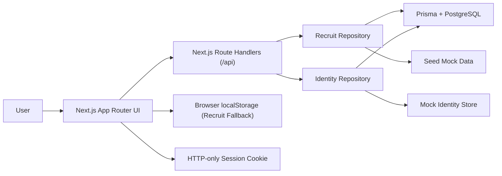
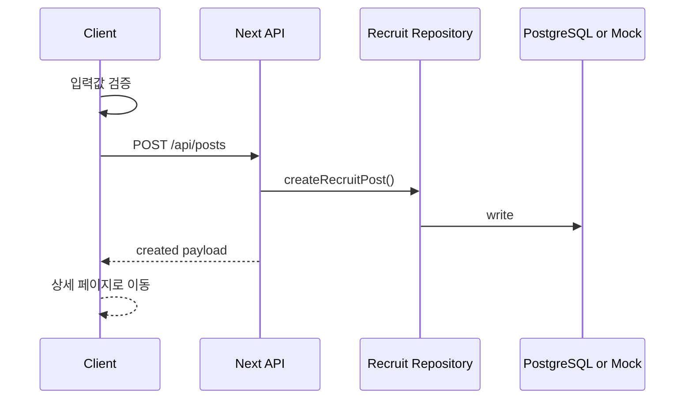
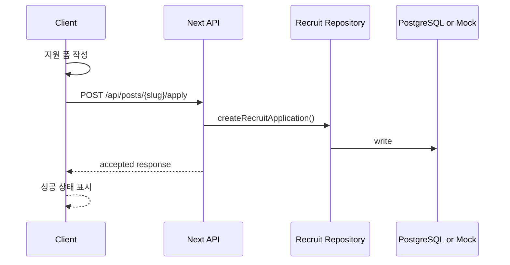
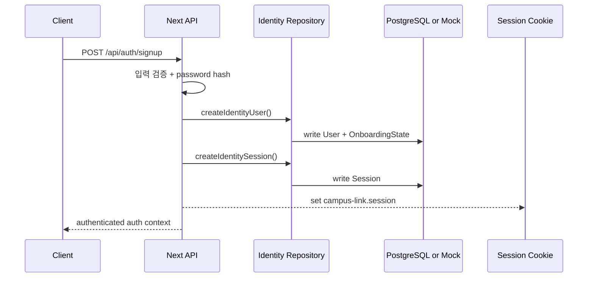
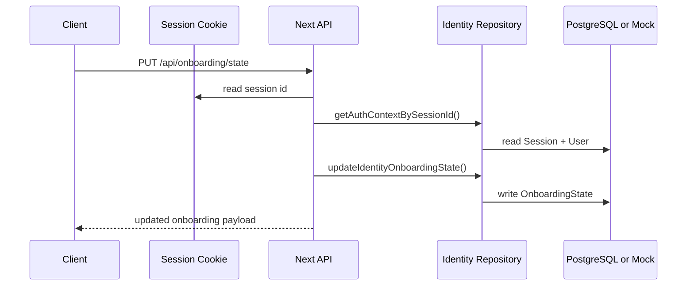

# 02. Architecture

## 1) 기술 스택 선택 이유

| 영역 | 선택 기술 | 선택 이유 | 대안 |
| --- | --- | --- | --- |
| Frontend | Next.js 16 + React 19 + TypeScript | Vercel 배포가 가장 자연스럽고 App Router로 페이지 구성과 SEO 대응이 쉽다. | Vite + React |
| Styling | Tailwind CSS 4 | 랜딩 페이지와 카드 UI를 빠르게 조합하고 발표용 시각 밀도를 높이기 좋다. | CSS Modules |
| Mock API | Next.js Route Handlers | 별도 서버 없이도 API 형태를 흉내 내며 데모 흐름과 문서 일관성을 맞출 수 있다. | 프론트엔드 전용 상태 관리 |
| Database Layer | Prisma + PostgreSQL | 실제 서비스 전환 시 repository contract를 유지하면서 관계형 데이터 모델을 확장하기 쉽다. | MongoDB |
| Demo Storage | 브라우저 localStorage fallback | DB 환경 변수가 없을 때도 발표용 흐름을 유지할 수 있다. | IndexedDB |
| Infra | Vercel | Next.js 기본 배포 플랫폼이며 워크숍 시연에 적합하다. | Netlify |

## 2) 시스템 구성



설명:

- 프론트 역할: 랜딩, 목록, 상세, 글쓰기, 지원하기 화면 렌더링과 상호작용 처리
- API 역할: 모집글 API와 함께 Phase 1용 auth / onboarding API 응답 제공
- Repository 역할: `RECRUIT_DATA_SOURCE` 값에 따라 PostgreSQL 또는 mock 저장소를 선택
- Recruit 데이터 저장 방식: 기본값은 seed 데이터와 localStorage fallback, DB 모드에서는 Prisma를 통해 PostgreSQL 사용
- Identity 데이터 저장 방식: Phase 1 기준으로 같은 data source 모드를 따르며, mock 모드에서는 메모리 저장소와 demo 계정을 사용하고 DB 모드에서는 Prisma `User`, `Session`, `OnboardingState`를 사용한다
- 세션 경계: 세션 본문은 서버 저장소에 보관하고, 브라우저에는 `campus-link.session` HTTP-only cookie로 세션 식별자만 전달한다

## 3) 레이어 구조

- App Router Page: 경로별 화면 구성
- UI Components: 카드, 배지, 헤더, 폼, CTA 등 재사용 컴포넌트
- Feature Layer: 모집글 목록 필터링, 글쓰기, 지원하기 흐름
- Identity Contracts: `User`, `Role`, `Session`, `OnboardingState`와 auth context 타입
- Recruit Repository: Prisma/PostgreSQL과 mock 저장소를 전환하는 유틸
- Identity Repository: mock 계정, 세션, 온보딩 상태를 관리하고 Prisma 저장소와 전환하는 유틸
- Route Handlers: `/api/posts`, `/api/auth/*`, `/api/onboarding/state` 등 API 응답
- Session Helper: cookie 기반 현재 세션 조회를 downstream 브랜치가 재사용할 수 있게 제공

현재 프로젝트 구조:

```text
prisma/
├─ schema.prisma
src/
├─ app/
│  ├─ api/
│  │  ├─ auth/
│  │  └─ onboarding/
│  ├─ recruit/
│  └─ page.tsx
├─ components/
├─ data/
├─ lib/
│  └─ server/
└─ types/
```

## 4) 데이터 모델

### Entity A. RecruitPost

| 필드 | 타입 | 설명 | 필수 여부 |
| --- | --- | --- | --- |
| `id` | `string` | 내부 식별자 | Yes |
| `slug` | `string` | 상세 페이지 경로 식별자 | Yes |
| `title` | `string` | 모집글 제목 | Yes |
| `category` | `"study" | "project" | "hackathon"` | 모집 유형 | Yes |
| `campus` | `string` | 활동 캠퍼스 또는 온라인 여부 | Yes |
| `summary` | `string` | 카드용 요약 문장 | Yes |
| `description` | `string` | 상세 설명 | Yes |
| `roles` | `string[]` | 모집 역할 목록 | Yes |
| `techStack` | `string[]` | 사용 기술 | No |
| `capacity` | `number` | 추가 모집 인원 | Yes |
| `stage` | `string` | 아이디어 단계, 진행 중 등 상태 | Yes |
| `deadline` | `string` | 모집 마감일 | Yes |
| `createdAt` | `string` | 생성 시각 | Yes |
| `highlight` | `boolean` | 메인 강조 노출 여부 | Yes |

### Entity B. RecruitApplication

| 필드 | 타입 | 설명 | 필수 여부 |
| --- | --- | --- | --- |
| `id` | `string` | 내부 식별자 | Yes |
| `postSlug` | `string` | 지원 대상 모집글 slug | Yes |
| `name` | `string` | 지원자 이름 | Yes |
| `contact` | `string` | 이메일 또는 오픈채팅 링크 | Yes |
| `message` | `string` | 자기소개 및 지원 동기 | Yes |
| `createdAt` | `string` | 지원 시각 | Yes |

### Shared Enum C. Role

| 값 | 설명 |
| --- | --- |
| `student` | 일반 사용자 기본 역할 |
| `admin` | 관리자 기본 역할 |

### Entity D. User

| 필드 | 타입 | 설명 | 필수 여부 |
| --- | --- | --- | --- |
| `id` | `string` | 내부 사용자 식별자 | Yes |
| `email` | `string` | 로그인 식별 이메일 | Yes |
| `displayName` | `string` | UI 노출 기본 이름 | Yes |
| `campus` | `string \| null` | 캠퍼스 또는 소속 텍스트 | No |
| `role` | `Role` | 역할 구분 | Yes |
| `createdAt` | `string` | 가입 시각 | Yes |
| `updatedAt` | `string` | 마지막 수정 시각 | Yes |

주의:

- `passwordHash`는 저장소 전용 필드이며 shared `User` contract와 API 응답에는 포함하지 않는다.

### Entity E. Session

| 필드 | 타입 | 설명 | 필수 여부 |
| --- | --- | --- | --- |
| `id` | `string` | 서버 저장 세션 식별자 | Yes |
| `userId` | `string` | 세션 소유 사용자 id | Yes |
| `createdAt` | `string` | 세션 생성 시각 | Yes |
| `expiresAt` | `string` | 세션 만료 시각 | Yes |

경계 메모:

- 브라우저에는 세션 전체를 저장하지 않고 `campus-link.session` cookie에 `id`만 담는다.
- 보호 라우트와 profile shell은 cookie -> `Session` -> `User` 순서로 현재 사용자를 해석한다.

### Entity F. OnboardingState

| 필드 | 타입 | 설명 | 필수 여부 |
| --- | --- | --- | --- |
| `userId` | `string` | 사용자 id와 동일한 1:1 key | Yes |
| `status` | `"not_started" \| "in_progress" \| "completed"` | 온보딩 전체 상태 | Yes |
| `currentStep` | `"account" \| "interests" \| "profile" \| "complete"` | 현재 또는 마지막 step | Yes |
| `interestKeywords` | `string[]` | 설문에서 선택한 관심 키워드 | Yes |
| `completedAt` | `string \| null` | 완료 시각 | No |
| `createdAt` | `string` | 온보딩 레코드 생성 시각 | Yes |
| `updatedAt` | `string` | 마지막 수정 시각 | Yes |

경계 메모:

- `OnboardingState`는 `User`에 인라인으로 섞지 않고 별도 레코드로 유지한다.
- signup 직후 기본 상태는 `in_progress / interests`이며, 이후 survey 브랜치가 step별 UI를 이 계약 위에 올린다.

## 5) 정합성 규칙

- `slug`는 고유해야 한다.
- 글쓰기 폼의 필수 항목이 비어 있으면 게시글을 생성할 수 없다.
- 같은 모집글에 동일 연락처로 중복 지원하면 막아야 한다.
- `email`은 사용자 단위로 고유해야 한다.
- 인증 비밀값은 `User` shared contract에 포함하지 않고 서버 저장소에만 둔다.
- `Session`은 서버 저장소의 source of truth를 따르고, cookie는 세션 식별자 전달 경계로만 사용한다.
- `OnboardingState`는 `User`와 별도 1:1 레코드로 유지하며, survey 진행도와 관심 키워드는 이 레코드에만 기록한다.
- `RECRUIT_DATA_SOURCE=database`일 때 Recruit와 Identity 모두 PostgreSQL/Prisma를 사용한다.
- `RECRUIT_DATA_SOURCE=mock`일 때 Recruit는 seed/localStorage fallback을, Identity는 demo 계정과 runtime mock 저장소를 사용한다.

## 6) 핵심 시퀀스 다이어그램

### Flow A. 모집글 작성



### Flow B. 모집글 지원하기



### Flow C. 회원가입 후 세션 생성



### Flow D. 온보딩 상태 갱신



## 7) 운영/배포 메모

- 실행 환경: Node.js 24 로컬 개발, Vercel 배포
- 환경 변수: `DATABASE_URL`, `DATABASE_URL_UNPOOLED`, `RECRUIT_DATA_SOURCE`
- cookie 이름: `campus-link.session`
- 배포 전략: GitHub 연동 후 Vercel에서 Next.js 프로젝트로 Import
- 로깅/모니터링 계획: 워크숍 MVP에서는 브라우저 콘솔과 Vercel 배포 로그 수준으로 제한
