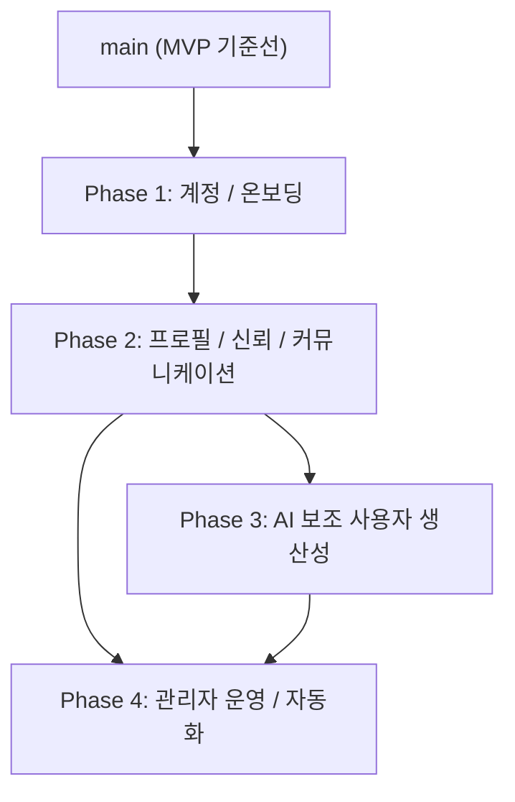

# 05. Codex Collaboration Playbook

이 문서는 사람 온보딩용 설명서보다, 팀원 각자의 Codex가 같은 프로젝트 규칙을 빠르게 읽고 같은 방식으로 움직이게 하기 위한 운영 가이드다.

주의:

- 이 문서는 `docs/01` ~ `docs/04`를 보조하는 실행 가이드다.
- 요구사항과 설계 충돌 시에는 항상 `docs/01` ~ `docs/04`를 우선한다.
- 이 문서의 목적은 확장 계획을 Phase 단위로 운영 가능하게 만들고, 각 Phase를 4명이 병렬로 개발할 수 있게 쪼개는 것이다.

## 1) Codex 시작 순서

각 팀원은 새 작업을 시작할 때 Codex에게 아래 순서로 읽게 한다.

1. `AGENTS.md`
2. `docs/01-product-planning.md`
3. `docs/02-architecture.md`
4. `docs/03-api-reference.md`
5. `docs/04-development-guide.md`
6. `docs/06-testing-playbook.md`
7. 이 문서의 본인 담당 Phase / 트랙 섹션

## 2) 공통 시작 프롬프트

모든 팀원이 공통으로 쓸 수 있는 기본 프롬프트:

```text
Read AGENTS.md and docs/01-product-planning.md through docs/06-testing-playbook.md.
Work only inside the scope of branch <branch-name>.
Before coding, summarize the assigned outcome, allowed files, fixed contracts, and dependent branches.
Then implement only that branch scope, run the relevant checks, and prepare a PR-ready summary.
```

## 3) 공통 작업 원칙

- 한 Codex는 한 브랜치의 한 결과만 다룬다.
- 담당 브랜치 범위를 벗어난 파일은 수정하지 않는다.
- 스키마/API/프로세스 변경이 있으면 관련 docs를 같은 브랜치에서 업데이트한다.
- PR 전에는 `main` 최신 내용이 반영됐는지 확인한다.
- 충돌이 나면 기능을 더 밀어붙이지 말고 충돌 해결 후 다시 진행한다.
- 테스트는 `docs/06-testing-playbook.md` 기준으로 branch scope 안에서만 만든다.
- 상위 브랜치가 아직 머지되지 않았다면, downstream 브랜치는 최종 계약을 추측하지 말고 branch-local adapter로 격리한다.
- 공통 타입, 세션 형식, API 응답 형식은 각 브랜치가 따로 정의하지 않고 담당 Phase의 contract 브랜치를 따라간다.

## 4) 전체 확장 페이즈 지도

현재 확장 계획은 아래 4개 Phase로 운영한다.

| Phase | 제품 목표 | 대표 기능 | Phase Gate |
| --- | --- | --- | --- |
| 1 | 계정과 온보딩 기반 고정 | 로그인 / 회원가입, 설문, 사용자 기본 프로필, 관리자 기본 프로필 | `User`, `Role`, `Session`, `OnboardingState` 계약이 고정되어야 한다 |
| 2 | 프로필 신뢰도와 커뮤니케이션 기반 고정 | 추가 인증, 인증 마크, 이력서 기본 편집, 문의하기, 알림 설정 | `Profile`, `Resume`, `Verification`, `Inquiry`, `AlertPreference` 계약이 고정되어야 한다 |
| 3 | AI 보조 사용자 생산성 확장 | GitHub 등록, AI 프로젝트 분석, 이력서 AI 자동 완성, 모집글 자동 완성 | AI 입력 데이터와 응답 형식, 외부 연동 경계가 고정되어야 한다 |
| 4 | 관리자 운영과 자동화 확장 | 게시글 관리, AI 자동 필터링, 강도 조절, 문의 / 알림 운영 처리 | 운영 권한, moderation 결과, 알림 이벤트 계약이 고정되어야 한다 |

핵심 원칙:

- 한 Phase 안에서는 4명이 동시에 움직일 수 있게 A, B, C, D 네 개 트랙으로 쪼갠다.
- 각 Phase의 A 트랙은 공통 계약과 저장 경계를 먼저 고정하는 foundation 브랜치다.
- B, C, D 트랙은 UI shell과 feature-local adapter를 먼저 만들 수 있지만, 최종 계약은 A 트랙을 따라간다.

## 5) 페이즈 의존성 트리



해석:

- Phase 1은 모든 확장 기능의 시작점이다.
- Phase 2는 신뢰도, 문의, 알림, 이력서 같은 사용자 입력 구조를 고정한다.
- Phase 3은 Phase 2가 만든 입력 데이터를 재사용해 AI 품질을 높인다.
- Phase 4는 Phase 2의 운영 데이터와 Phase 3의 AI 계약을 함께 재사용한다.

## 6) 페이즈 운영 규칙

1. 각 Phase는 항상 A, B, C, D 네 개 브랜치로 나눈다.
2. A 트랙이 그 Phase의 공통 타입, API shape, 저장 경계를 먼저 고정한다.
3. B, C, D 트랙은 A 트랙 머지 전에도 시작할 수 있지만, 이때는 branch-local adapter 뒤에서만 mock을 사용한다.
4. A 트랙이 머지되면 B, C, D는 즉시 `main`을 다시 동기화하고 shared contract로 교체한다.
5. 다음 Phase의 본격 구현은 현재 Phase Gate가 통과된 뒤 시작한다.
6. Phase가 길어져도 한 브랜치가 두 Phase의 목표를 동시에 다루지 않는다.

## 7) 페이즈별 4분할 실행 계획

### Phase 1. 계정과 온보딩 기반

| 트랙 | 권장 브랜치 | 핵심 목표 | 선행 의존성 | mock-first 허용 범위 |
| --- | --- | --- | --- | --- |
| A | `feature/p1-identity-contracts` | `User`, `Role`, `Session`, `OnboardingState` 계약, auth 저장 경계, 기본 API shape 고정 | 없음 | 없음. 이 브랜치가 Phase 1 source of truth다 |
| B | `feature/p1-auth-entry` | 로그인 / 회원가입 UI, 세션 진입 흐름, 보호 라우트 연결 | A의 최종 계약 필요 | 화면과 임시 form state만 먼저 구현 가능 |
| C | `feature/p1-onboarding-survey` | 관심 키워드 설문, 온보딩 step UI, 완료 상태 반영 | A 필수, B 권장 | 설문 화면과 로컬 상태만 먼저 구현 가능 |
| D | `feature/p1-profile-shell` | 사용자 기본 프로필 UI, 관리자 기본 프로필 shell, 역할별 진입 구조 | A 필수, B 권장 | profile shell과 layout만 먼저 구현 가능 |

Phase 1 merge 순서:

1. A
2. B, C, D 병렬
3. 통합 확인 후 Phase 1 종료

### Phase 2. 프로필 신뢰도와 커뮤니케이션 기반

| 트랙 | 권장 브랜치 | 핵심 목표 | 선행 의존성 | mock-first 허용 범위 |
| --- | --- | --- | --- | --- |
| A | `feature/p2-profile-communication-contracts` | `Profile`, `Resume`, `Verification`, `Inquiry`, `AlertPreference` 계약과 API 경계 고정 | Phase 1 완료 | 없음. 이 브랜치가 Phase 2 source of truth다 |
| B | `feature/p2-verification-badge` | 추가 인증 플로우, 인증 마크 표시, 상태별 UX | A 필수 | 배지 UI와 상태 화면만 먼저 구현 가능 |
| C | `feature/p2-resume-workspace` | 이력서 기본 편집, completeness 표시, 프로필 연동 | A 필수 | editor shell과 임시 저장 UX 먼저 가능 |
| D | `feature/p2-inquiry-alert-center` | 문의하기 제출 UI, 알림 설정 UI, 사용자 커뮤니케이션 센터 | A 필수 | 폼 UI와 설정 화면만 먼저 구현 가능 |

Phase 2 merge 순서:

1. A
2. B, C, D 병렬
3. 문의 / 알림 / 이력서 / 인증 상태 통합 확인 후 Phase 2 종료

### Phase 3. AI 보조 사용자 생산성

| 트랙 | 권장 브랜치 | 핵심 목표 | 선행 의존성 | mock-first 허용 범위 |
| --- | --- | --- | --- | --- |
| A | `feature/p3-ai-platform-contracts` | GitHub 연결 정보, AI request/response schema, job 상태, provider abstraction 고정 | Phase 1, 2 완료 | 없음. 이 브랜치가 Phase 3 source of truth다 |
| B | `feature/p3-github-analysis` | GitHub 등록, 연결 상태 관리, AI 프로젝트 분석 결과 UI | A 필수 | 연결 화면과 canned analysis UI 먼저 가능 |
| C | `feature/p3-resume-ai-assist` | 이력서 AI 자동 완성, suggestion 적용 UX | A 필수, Phase 2 C 권장 | 추천 미리보기와 적용 UI 먼저 가능 |
| D | `feature/p3-post-ai-assist` | 모집글 자동 완성, 제목 / 요약 / 설명 suggestion UX | A 필수, 기존 글쓰기 흐름 필요 | suggestion drawer와 apply UX 먼저 가능 |

Phase 3 merge 순서:

1. A
2. B, C, D 병렬
3. AI 결과 적용, 실패 처리, 재시도 UX 확인 후 Phase 3 종료

### Phase 4. 관리자 운영과 자동화

| 트랙 | 권장 브랜치 | 핵심 목표 | 선행 의존성 | mock-first 허용 범위 |
| --- | --- | --- | --- | --- |
| A | `feature/p4-admin-ops-contracts` | admin 권한, moderation 결과, inquiry queue, notification event, audit 경계 고정 | Phase 2 완료, Phase 3 권장 | 없음. 이 브랜치가 Phase 4 source of truth다 |
| B | `feature/p4-admin-profile-content` | 관리자 프로필, 게시글 관리 대시보드, 운영 목록 UI | A 필수 | dashboard shell과 table/card UI 먼저 가능 |
| C | `feature/p4-ai-filter-control` | AI 자동 필터링 결과 표시, 강도 조절, 예외 처리 UX | A 필수, Phase 3 A 권장 | slider와 result panel UI 먼저 가능 |
| D | `feature/p4-ops-inbox-notifications` | 문의 운영 inbox, 알림 운영 화면, 사용자 대상 발송 / 상태 확인 UX | A 필수, Phase 2 D 권장 | inbox UI와 상태 배지 먼저 가능 |

Phase 4 merge 순서:

1. A
2. B, C, D 병렬
3. 운영 권한, 필터 결과, 문의 / 알림 처리 흐름 확인 후 Phase 4 종료

## 8) 페이즈별 공통 계약 체크리스트

아래 계약은 각 Phase의 A 트랙이 먼저 고정해야 한다.

| Phase | 먼저 고정할 계약 | downstream 규칙 |
| --- | --- | --- |
| 1 | `User`, `Role`, `Session`, `OnboardingState` | B, C, D는 사용자 식별자나 세션 구조를 따로 만들지 않는다 |
| 2 | `Profile`, `Resume`, `VerificationBadge`, `Inquiry`, `AlertPreference` | B, C, D는 독자적인 폼 저장 구조를 최종안처럼 굳히지 않는다 |
| 3 | `GitHubConnection`, `AiSuggestionRequest`, `AiSuggestionResponse`, `AiJobStatus` | B, C, D는 AI 응답 키 이름이나 상태 enum을 따로 만들지 않는다 |
| 4 | `AdminRole`, `ModerationResult`, `InquiryThread`, `NotificationEvent`, `AuditLog` | B, C, D는 운영 상태 모델을 독자적으로 추가하지 않는다 |

실무 규칙:

1. 타입 이름과 API 키 이름은 Phase 안에서 하나로 맞춘다.
2. contract 브랜치가 머지되기 전에는 mock을 adapter 뒤에만 둔다.
3. 공통 계약 변경이 생기면 PR 설명에 downstream 영향과 교체 포인트를 적는다.

## 9) 파일 경계와 충돌 회피 규칙

트랙별 기본 파일 경계는 아래 기준을 따른다.

### A 트랙 공통

주 수정 영역:

- `prisma/`
- `src/types/`
- `src/lib/`
- `src/app/api/`
- `docs/02-architecture.md`
- `docs/03-api-reference.md`
- `docs/04-development-guide.md` 또는 `docs/05-codex-collaboration-playbook.md`가 바뀌면 같이 반영

가능하면 건드리지 말 것:

- unrelated marketing UI
- 다른 트랙이 담당 중인 세부 화면 레이아웃

### B, C, D 트랙 공통

주 수정 영역:

- `src/app/`의 해당 기능 경로
- `src/components/`의 해당 기능 컴포넌트
- feature-local adapter 또는 client helper
- 필요 시 `docs/03-api-reference.md`

가능하면 건드리지 말 것:

- Prisma schema 전체 재설계
- shared contract 타입의 독자 분기
- 전역 layout/navigation 대규모 변경

공통 조율이 필요한 영역:

- `src/components/layout/` 또는 전역 header/nav
- `src/types/`의 shared contract
- `docs/02-architecture.md`, `docs/03-api-reference.md`

## 10) 페이즈용 시작 프롬프트 템플릿

아래 템플릿은 branch name과 phase name만 바꿔서 그대로 사용할 수 있다.

### A 트랙 시작 프롬프트

```text
Read AGENTS.md and docs/01 through docs/06.
Work only inside branch <branch-name>.
This is the A track of <phase-name>, so this branch owns the phase contracts.
Before coding, summarize the fixed contracts, allowed files, and downstream branches that will depend on this work.
Implement only the contract, storage, and API boundaries for this phase without redesigning unrelated feature UI.
Update the relevant docs in the same branch, run the relevant checks, and end with a downstream handoff summary.
```

### B, C, D 트랙 시작 프롬프트

```text
Read AGENTS.md and docs/01 through docs/06.
Work only inside branch <branch-name>.
This branch belongs to <phase-name> and must follow the A-track contract for that phase.
If the contract branch is not merged yet, keep temporary data behind a branch-local adapter and do not invent final shared types or API shapes.
Implement only this branch scope, run the relevant checks, and finish with the exact replacement points for integration.
```

### mock-first fallback 프롬프트

```text
Read AGENTS.md and docs/01 through docs/06.
Work only inside branch <branch-name>.
Upstream phase contracts are not fully merged yet.
Build only the UI shell, feature-local adapter, and branch-scope tests.
Do not finalize schema, API, or session structures owned by another branch.
At the end, list the assumptions, mocked contracts, and integration blockers.
```

## 11) 페이즈별 실제 실행 프롬프트

아래 프롬프트는 템플릿이 아니라, 각 Phase와 트랙에 맞춰 바로 복붙해서 실행할 수 있는 기본형이다.

### Phase 1 A. `feature/p1-identity-contracts`

```text
Read AGENTS.md and docs/01 through docs/06.
Work only inside feature/p1-identity-contracts.
Implement only Phase 1 A track.
Define the shared contracts and storage boundaries for User, Role, Session, and OnboardingState, plus the base auth and onboarding API shapes.
Do not redesign unrelated UI.
Update docs/02 and docs/03 if contracts change, run the relevant checks, and end with a downstream handoff summary for feature/p1-auth-entry, feature/p1-onboarding-survey, and feature/p1-profile-shell.
```

### Phase 1 B. `feature/p1-auth-entry`

```text
Read AGENTS.md and docs/01 through docs/06.
Work only inside feature/p1-auth-entry.
Implement only Phase 1 B track.
Build the login and signup entry flow, session entry UX, and protected route integration on top of the Phase 1 A contracts.
If feature/p1-identity-contracts is not merged yet, keep temporary data behind a branch-local adapter and do not invent final session or user shapes.
Do not redesign unrelated survey or profile screens.
Run the relevant checks and finish with the integration points for feature/p1-onboarding-survey and feature/p1-profile-shell.
```

### Phase 1 C. `feature/p1-onboarding-survey`

```text
Read AGENTS.md and docs/01 through docs/06.
Work only inside feature/p1-onboarding-survey.
Implement only Phase 1 C track.
Build the signup survey, keyword selection flow, onboarding step UI, and completion-state handling using the Phase 1 contracts.
If feature/p1-identity-contracts is not merged yet, keep temporary survey state behind a branch-local adapter and do not finalize shared onboarding shapes yourself.
Do not redesign unrelated auth entry or profile management screens.
Run the relevant checks and end with the replacement points needed after the contract branch is merged.
```

### Phase 1 D. `feature/p1-profile-shell`

```text
Read AGENTS.md and docs/01 through docs/06.
Work only inside feature/p1-profile-shell.
Implement only Phase 1 D track.
Build the basic user profile shell, the admin profile shell, and the role-based entry structure using the Phase 1 contracts.
If feature/p1-identity-contracts is not merged yet, keep temporary data behind a branch-local adapter and do not finalize role or profile shapes yourself.
Do not redesign unrelated login, signup, or survey flows.
Run the relevant checks and finish with the exact integration points for later profile, verification, and admin work.
```

### Phase 2 A. `feature/p2-profile-communication-contracts`

```text
Read AGENTS.md and docs/01 through docs/06.
Work only inside feature/p2-profile-communication-contracts.
Implement only Phase 2 A track.
Define the shared contracts and API boundaries for Profile, Resume, Verification, Inquiry, and AlertPreference on top of the merged Phase 1 identity model.
Do not redesign unrelated UI.
Update docs/02 and docs/03 if contracts change, run the relevant checks, and end with a downstream handoff summary for the three other Phase 2 branches.
```

### Phase 2 B. `feature/p2-verification-badge`

```text
Read AGENTS.md and docs/01 through docs/06.
Work only inside feature/p2-verification-badge.
Implement only Phase 2 B track.
Build the additional verification flow, verification status UI, and badge display states using the Phase 2 shared contracts.
If feature/p2-profile-communication-contracts is not merged yet, keep temporary state behind a branch-local adapter and do not invent final verification payloads or badge enums.
Do not redesign unrelated resume, inquiry, or alert settings screens.
Run the relevant checks and end with the integration points for downstream profile and admin features.
```

### Phase 2 C. `feature/p2-resume-workspace`

```text
Read AGENTS.md and docs/01 through docs/06.
Work only inside feature/p2-resume-workspace.
Implement only Phase 2 C track.
Build the basic resume editing workspace, completeness indicators, and profile-linked resume UX using the Phase 2 contracts.
If feature/p2-profile-communication-contracts is not merged yet, keep temporary data behind a branch-local adapter and do not finalize shared resume shapes yourself.
Do not redesign unrelated verification, inquiry, or alert settings flows.
Run the relevant checks and finish with the replacement points needed for later AI resume assistance.
```

### Phase 2 D. `feature/p2-inquiry-alert-center`

```text
Read AGENTS.md and docs/01 through docs/06.
Work only inside feature/p2-inquiry-alert-center.
Implement only Phase 2 D track.
Build the inquiry submission flow, alert settings UI, and the user-facing communication center using the Phase 2 contracts.
If feature/p2-profile-communication-contracts is not merged yet, keep temporary data behind a branch-local adapter and do not finalize inquiry or alert preference shapes yourself.
Do not redesign unrelated resume or verification UX.
Run the relevant checks and finish with the integration points for later operations and notification work.
```

### Phase 3 A. `feature/p3-ai-platform-contracts`

```text
Read AGENTS.md and docs/01 through docs/06.
Work only inside feature/p3-ai-platform-contracts.
Implement only Phase 3 A track.
Define the shared contracts, provider boundaries, request and response schemas, and job-state model for GitHub analysis and AI suggestion features.
Do not redesign unrelated product UI.
Update docs/02 and docs/03 if contracts change, run the relevant checks, and end with a downstream handoff summary for the three other Phase 3 branches.
```

### Phase 3 B. `feature/p3-github-analysis`

```text
Read AGENTS.md and docs/01 through docs/06.
Work only inside feature/p3-github-analysis.
Implement only Phase 3 B track.
Build the GitHub registration flow, connection status management, and AI project analysis result UI using the Phase 3 contracts.
If feature/p3-ai-platform-contracts is not merged yet, keep temporary data behind a branch-local adapter and do not finalize provider responses or analysis payload shapes yourself.
Do not redesign unrelated resume or post-writing AI flows.
Run the relevant checks and finish with the integration points for reuse in profile and admin surfaces.
```

### Phase 3 C. `feature/p3-resume-ai-assist`

```text
Read AGENTS.md and docs/01 through docs/06.
Work only inside feature/p3-resume-ai-assist.
Implement only Phase 3 C track.
Build the AI resume suggestion flow, preview and apply UX, and failure or retry handling on top of the Phase 2 resume workspace and Phase 3 contracts.
If feature/p3-ai-platform-contracts is not merged yet, keep temporary suggestion data behind a branch-local adapter and do not finalize shared AI response shapes yourself.
Do not redesign unrelated GitHub analysis or post-writing AI screens.
Run the relevant checks and finish with the exact integration points for the resume workspace.
```

### Phase 3 D. `feature/p3-post-ai-assist`

```text
Read AGENTS.md and docs/01 through docs/06.
Work only inside feature/p3-post-ai-assist.
Implement only Phase 3 D track.
Build the recruit-post AI assistance flow for title, summary, and description suggestions on top of the existing post creation flow and the Phase 3 contracts.
If feature/p3-ai-platform-contracts is not merged yet, keep temporary suggestion data behind a branch-local adapter and do not finalize shared AI request or response shapes yourself.
Do not redesign unrelated GitHub analysis or resume AI screens.
Run the relevant checks and finish with the exact integration points for the post creation flow.
```

### Phase 4 A. `feature/p4-admin-ops-contracts`

```text
Read AGENTS.md and docs/01 through docs/06.
Work only inside feature/p4-admin-ops-contracts.
Implement only Phase 4 A track.
Define the shared contracts and storage boundaries for admin roles, moderation results, inquiry queues, notification events, and audit records on top of the earlier phase contracts.
Do not redesign unrelated UI.
Update docs/02 and docs/03 if contracts change, run the relevant checks, and end with a downstream handoff summary for the three other Phase 4 branches.
```

### Phase 4 B. `feature/p4-admin-profile-content`

```text
Read AGENTS.md and docs/01 through docs/06.
Work only inside feature/p4-admin-profile-content.
Implement only Phase 4 B track.
Build the admin profile surface, content management dashboard, and operational content list UI using the Phase 4 contracts.
If feature/p4-admin-ops-contracts is not merged yet, keep temporary data behind a branch-local adapter and do not finalize shared moderation or admin payload shapes yourself.
Do not redesign unrelated AI filter controls or operations inbox screens.
Run the relevant checks and finish with the integration points for admin role enforcement.
```

### Phase 4 C. `feature/p4-ai-filter-control`

```text
Read AGENTS.md and docs/01 through docs/06.
Work only inside feature/p4-ai-filter-control.
Implement only Phase 4 C track.
Build the AI filtering result UI, strength control UX, and exception-handling flow using the Phase 4 contracts and the earlier AI platform contracts where needed.
If feature/p4-admin-ops-contracts is not merged yet, keep temporary data behind a branch-local adapter and do not finalize moderation result or filter-control shapes yourself.
Do not redesign unrelated admin dashboard or inbox screens.
Run the relevant checks and finish with the integration points for operations and moderation review.
```

### Phase 4 D. `feature/p4-ops-inbox-notifications`

```text
Read AGENTS.md and docs/01 through docs/06.
Work only inside feature/p4-ops-inbox-notifications.
Implement only Phase 4 D track.
Build the operations inbox for inquiries, the notification operations screen, and the delivery or status management UX using the Phase 4 contracts.
If feature/p4-admin-ops-contracts is not merged yet, keep temporary data behind a branch-local adapter and do not finalize inquiry queue or notification event shapes yourself.
Do not redesign unrelated admin profile or AI filter control screens.
Run the relevant checks and finish with the integration points for alert settings, inquiry history, and admin review flows.
```

## 12) PR 직전 Codex 체크 프롬프트

PR 올리기 전에 각 팀원은 아래 프롬프트를 한 번 더 쓰는 것이 좋다.

```text
Review this branch only against AGENTS.md and docs/01 through docs/06.
Check whether the changes stayed within the assigned branch scope, whether any required docs are missing, and whether lint/build or branch-specific tests are still needed before PR.
List only blocking findings first.
```

테스트 관점 점검은 아래 프롬프트를 추가로 쓴다.

```text
Review this branch only against AGENTS.md and docs/01 through docs/06.
Check missing tests inside this branch scope only.
Separate automated tests from manual smoke checks.
State clearly what Codex can verify directly and what still needs a human or browser automation.
```

## 13) 팀 운영 팁

- 팀장은 각 Phase 시작 전에 A, B, C, D 담당자를 먼저 고정한다.
- Codex에게는 "전체 프로젝트"가 아니라 "지금 네 Phase의 지금 네 트랙"만 맡긴다.
- Phase 중간에 계약이 흔들리기 시작하면, 먼저 A 트랙에서 정리하고 나머지 브랜치가 다시 따라오게 한다.
- 같은 파일을 두 트랙이 동시에 건드려야 한다면 먼저 파일 경계를 다시 나눈다.
- downstream 브랜치가 오래 열려 있다면 upstream 머지 직후 바로 `main`을 다시 반영한다.
